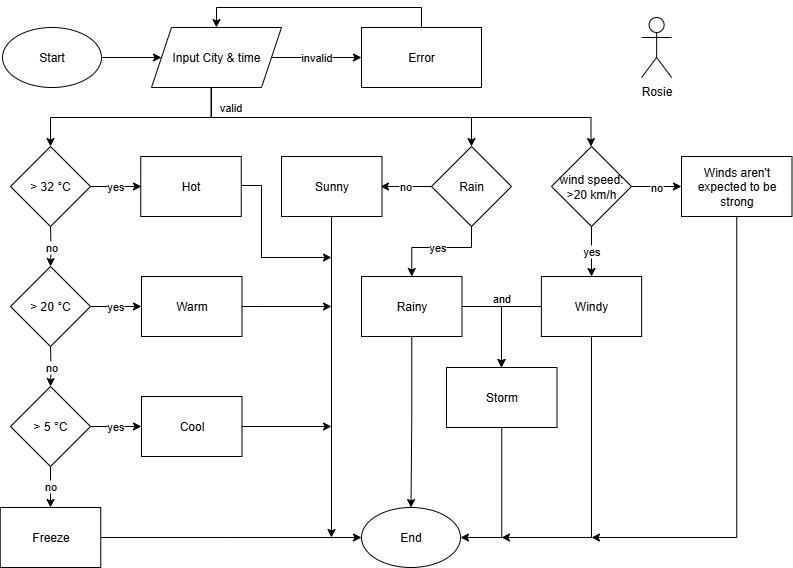

# WhatToWear
A prototype of a web application that recommends outfits based on real-time weather data.

**Ever picked the wrong outfit and regretted it when the weather changed unexpectedly? This is a simple prototype designed to provide outfit recommendations based on the current weather conditions. The goal is to help users be prepared and confident in their daily attire.**

### Features
* Provides outfit recommendations based on average heat index*.
* Offers additional suggestions for rainy or windy weather.
* Integrates with an external weather API to fetch real-time data.
* Provides hourly weather forecasts for up to one week ahead.

*The heat index is a measure that combines air temperature and relative humidity to determine the perceived temperature, indicating how hot it feels to the human body.

### Logic (Algorithm)
1. The app requests the user's location and the specific date/time for which they need a recommendation.
2. Weather data (temperature, wind speed, rain probability) is retrieved from an API.
3. Based on the data, the app analyzes the conditions and provides a recommendation.
   * If there is a possibility of rain and/or strong wind, it will give a warning.
   * Based on temperature:
      * Above 32°C: Recommends thin, breathable clothing.
      * Between 25°C - 32°C: Recommends light, comfortable clothes.
      * Between 5°C - 25°C: Suggests wearing a jacket or sweater.
      * Below 5°C: Recommends wearing warm, insulated layers and accessories like a scarf and gloves.

### Technologies Used
* Python: The core logic of the application, including data processing and recommendation algorithm.
* Open-Meteo API: For fetching real-time weather data.
